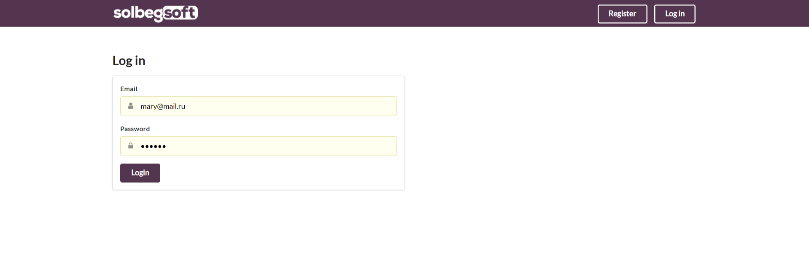
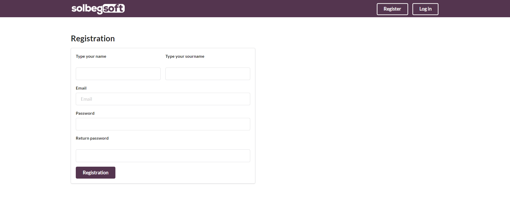
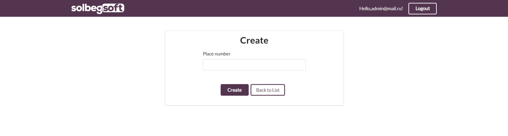
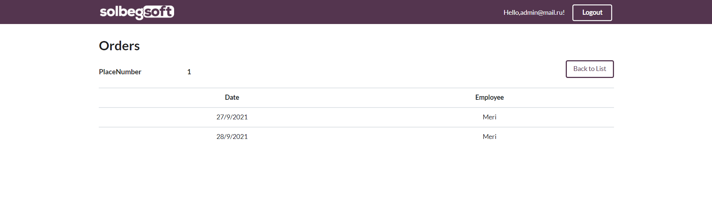
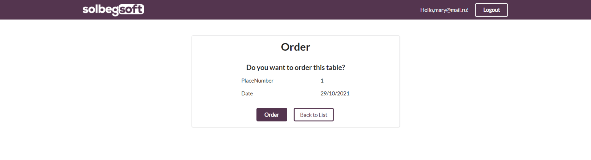
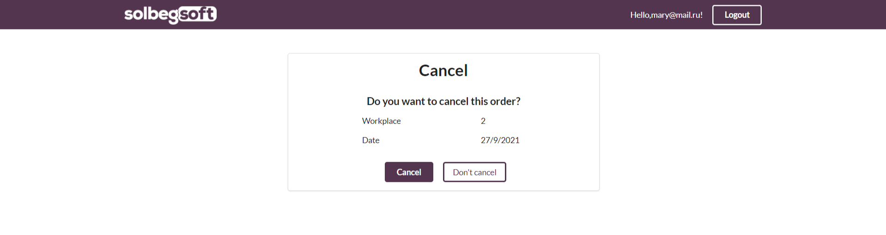

# Workplaces
Web Application for bookin workplaces in officce

<h1>How to use</h1>
<ul>
  <li>
     <h3> When you will start this application, you will see the login page. 
      you should to log in if you already have an account? or registrate if you dont.</h3>
      
  </li>
  <li>
     <h3> If you go to registeration you should to fill in all the fields, then click on the registration button.</h3>
      
  </li>
  <li>
      <h3>if you are logged in as an administrator, you will see the following page with a list of workplaces".</h3>
      
      Here you can creat new place, delete or edit work place and also view plase's orders. 
          <ol>
            <li>
              <h4>Creating new workplace</h4>
              Here you should to fiil place number and then click the button.
              
            </li>
            <li>
              <h4>Edit workplace</h4>
              Here you can change the place number and work plcse's items.  When you done click the button.
              
            </li>
            <li>
              <h4>Removing the workplace</h4>
              Here you should to confirm the removing.
              
            </li>
            <li>
              <h4>View the workplace's orders</h4>
              
            </li>
         </ol>
  </li>
 <li>
      <h3>if you are logged in as an employee, you will see the following page".</h3> 
      
      Here you can select a day you want to job and order one of free tables, also you can view your orders and cancel your orders. 
          <ol>
            <li>
              <h4>Order the workplace</h4>
              Here you should to confirm the order.
              
            </li>
            <li>
              <h4>Cancel the order</h4>
              Here you should to confirm the cancel.
              
            </li>
         </oi>
  </li>

</ul>
